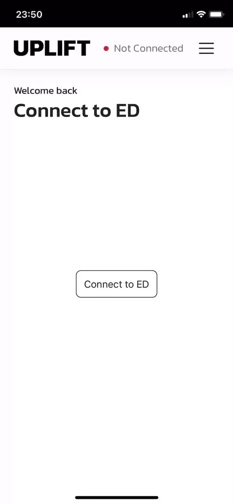
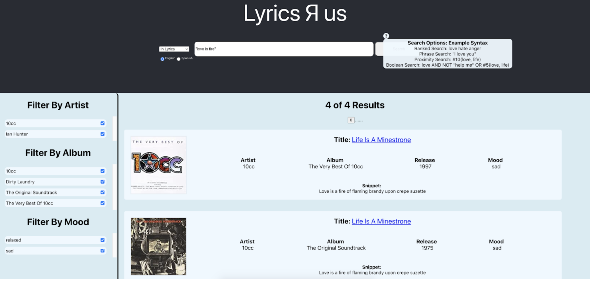
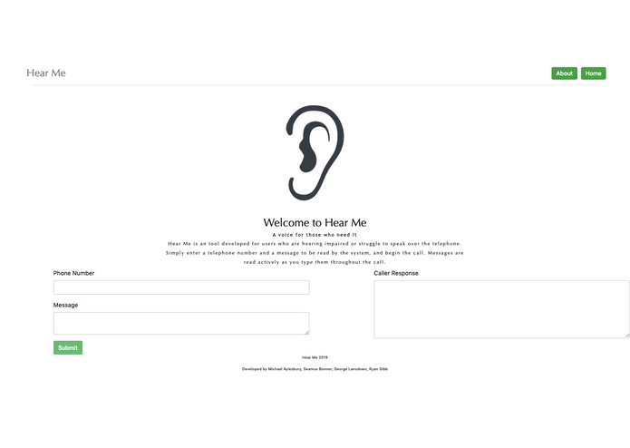

# Group Projects

## UPLIFT.ED Project
> React, JavaScript, HTML
<em>Role: Front-end developer</em>

We designed the product UPLIFT.ED, referred to as "ED" (Elevation Device). ED is an assistive robot designed primarily to aid mobility impaired consumers reach low down drawers by elevating an inner basket of a cabinet drawer to counter-top height.

I was responsible for front-end implementation, desigining mock-ups for the website and then carrying out implementation with the front-end team. My contribution and the lessons I learned can be found [here](https://nbviewer.org/github/moaylesbury/ED-Report/blob/main/s1751472-MichaelAylesbury-Group-15.pdf).

A phone demonstration:

## Search Engine Project
<em>Role: Back-end developer</em>
> Python

We created a custom song lyric search engine. Our website serves as an intuitive GUI allowing the user to perform boolean, phrase, proximity, and ranked lyrics queries in English and Spanish, all whilst filtering by artist, album, and mood. 

I was responsible for finding appropriate lyric websites for both English and Spanish lyrics. I then created the web crawler structure in Python. I took this structure and fully developed the Spanish scraper, as well as a controller acting as an entry point to run both scrapers. All lyrics were stored in a database for analysis, and unique word frequencies were analysed. The most frequent words were identified as stop words. My contributions and a specification of the system can be found [here](https://nbviewer.org/github/moaylesbury/ED-Report/blob/main/ttds_group20.pdf).

## Machine Learning Project
<em>Role: Researcher and writer</em>
> Overleaf, Google Compute

We explored semantic image segmentation in a supervised regime to evaluate and improve the robustness of the state-of-theart DeepLabv3+ architecture across the PASCAL Visual Object Challenge (VOC) 2012 data set. Through experimentation it is found that the baseline model (DeepLabv3+) performance degrades for the image augmentations such as gaussian blur, cutout, and scaling. We proposed three models to combat these perturbation within images. The proposed variants are deformable convolution, hierarchical attention, and hierarchical attention paired with a contour detection model. Our proposed networks were able to outperform the baseline MIoU (mean intersection over union) score by 2%, and were more robust to the aforementioned perturbations, evaluated using the CD (Corruption Degradation) metric. We found that our proposed deformable convolution model was more robust to scaling (CD = 0.9) compared to the baseline, and additionally, both variations of the hierarchical attention model were robust against perturbations such as cutout and Gaussian blur (CD = 0.95).

I was responsible for applying pertubations to images, researching and writing the paper, which can be found [here](https://nbviewer.org/github/moaylesbury/ED-Report/blob/main/MLP-Report.pdf).

## HearMe
<em>Role: Front-end developer</em> 
 
<em>Prize: JPMorgan Chase & Co. Empowering Minorities Award</em>
> React, JavaScript, HTML

Created an the Edinburgh, hackathon Hack the Burgh V, we were inspired by APIs developed by Nexmo, and J.P.Morgan's empowerment ideas. HearMe is our website, aimed at people who have hearing impairments or other conditions which make telephone conversations difficult or impossible. HearMe has a simple clean interface which takes in two arguments and returns one. It takes a phone number and a message. HearMe then calls the given number using the Nexmo API and reads the message. After the call, the speech from the other user is converted to text. It is 'a voice for those who need it'.

I was responsible for the mock-up design of the website, and the front-end implementation. The DevPost page for this project can be found [here](https://devpost.com/software/hear-me).

