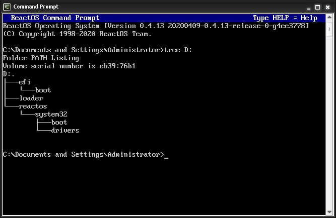

# Individual Projects

## Sudoku Solver 
> Python

A sudoku game created in python using the modules tkinter and numpy. This was my first time using tkinter, so it was interesting exploring the module to create a GUI. Numpy was used to create a matrix representation of the sudoku board. Aside from the grid, the interface consists of four buttons: Solve, New Board, Reset Board, and Solve. The solve button makes use of the [recursive backtracking algorithm](https://en.wikipedia.org/wiki/Sudoku_solving_algorithms#Backtracking), trying numbers 1-9. If the board cannot be solved then the algorithm goes back and tries different numbers until the board is solved.

In the future I would create a more sophisticated board generating algorithm, as the current one ends up with trends such as 1,2,3,4,5,6,7,8,9 in the first line and consecutive numbers appearing often.

## Bright Internship Work Sample 

> Python 

During the internship experience with the Bright Network, I received a seminar from Google employees who spoke about the company and the technology industry. They presented us with a brief for a task to implement a command line application with Python that replicates a number of YouTube core functionalities by parsing user commands through the terminal. This task was given a strict deadline of one day, requiring fast implementation with a focus on object-oriented, readable code.

I implemented a video libary class to fetch specific videos, or all videos (from an internal list created by parsing a CSV file). This class was heavily relied on by the main implementation, the video player class. The video player class allowed for playing, pausing, stopping and continuing videos, playlist creation, deletion and viewing, as well as video searching and flagging. Each function relied upon other functions and made sure conditions were in place before carrying out certain actions. This includes making sure a video is playing if the user tries to resume, checking the amount of flags on a video before playing, and ensuring playlists exist beore adding videos to them.

## Blender Image Composition with Physically Based Rendering and Photoshop 
> Blender, pbrt-v3, Photoshop

The goal of this project was to create a scene of carefully chosen and placed objects, and create a realistic looking composition with the following 3D models: a [doom combat scene](https://www.artec3d.com/3d-models/doom-combat-scene), a [bovine heart](https://www.artec3d.com/3d-models/bovine-heart), a [sea shell](https://www.artec3d.com/3d-models/sea-shell), a [pipe bend](https://www.artec3d.com/3d-models/pipe-bend), and a [dragon](https://www.artec3d.com/3d-models/dragon). These were all models I chose as I found them to be interesting.

I began by taking the original image 

Then, in order to cast realistic shadows and lighting, I measured the relative distance between all objects and shelf lengths, as well as the distance of the light source. All of these measurements were then used to model the scene in Blender. Images were also taken in order to texture the objects. Then the models were imported into Blender and placed, and I created textures and exported the scene using the [pbrt-v3](https://pbrt.org/users-guide) rendering system. Terminal was then used with pbrt in order to render the scene, which produced the following image.

This render allowed scene specific shadows and highlights to be formed. From here, the original image and the rendered image were taken into Photoshop, and a composite was created. Colour correcting and touchups were applied in order to achieve the best possible final product.

## Netflix Clone using AstraDB and GraphQL 
> AstraDB, GraphQL

This project was part of the DataStax development series. I created an AstraDB instance, and used GraphQL to create a movie and genre tabls, and populate it with a CSV dataset. This database was then conected to Netlify and the instance was deployed.

## Implementation of Basic, Stop-And-Wait, Go-Back-N, and Selective Repeat Data Transmission Protocols 

> Linux, virtual machine, Python, Vagrant

I used the Linux VM traffic control utility to emulate a link between two communicating processes; a sender and receiver. The TC utility allowed the kernel packet scheduler to emulate packet delay and loss, and limit bandwidth for UDP or TCP applications. Because sender and receiver processes for this are within the same VM, they communicate with each other through the loopback interface (lo).

This project implemented four protocol frameworks; basic transmission under ideal conditions, stop-and-wait, go-back-N, and selective repeat. There are two Python files for each respective protocol, named Sender1.py - Sender4.py and Receiver1.py - Receiver4.py.

### Basic transmission

This implementation allows transferring a file from the sender to the receiver on localhost over UDP as a sequence of small messages with 1KB maximum payload using the loopback interface, configured with 10Mbps bandwidth, 5ms one-way propagation delay (10ms round-trip) and 0% packet loss rate. Each 1KB message has a 3 byte header; a 2 byte sequence number and 1 byte end-of-file flag indicating the last message. It simply sends messages sequentially.

The receiver stores the transmitted data (removing headers) into a local file. The transfer is successful if the sent and received files match on a binary level, which was checked using the diff command.

python3 Sender1.py <RemoteHost IP> <Port> <Filename>

python3 Receiver1.py <Port> <Filename>

### Stop-and-wait

The Sender1.py and Receiver1.py programs were extended to implement the [Stop-and-Wait](https://www.isi.edu/nsnam/DIRECTED_RESEARCH/DR_HYUNAH/D-Research/stop-n-wait.html#:~:text=%22stop%2Dn%2Dwait%22,under%20unreliable%20packet%20delivery%20system.&text=After%20transmitting%20one%20packet%2C%20the,before%20transmitting%20the%20next%20one.) protocol. This code was based upon two finite state machines; one for the sender and one for the receiver. This protocol introduces the acknowledgement (ACK) message used by the receiver to inform the sender that a message had been received. ACK messages are 2 bytes, holding a sequence number. Duplicates were deleted at the receiver end using sequence numbers. A 5% packet loss rate was used, with the rest of TC configuration parameters as
before. The sender outputs the number of retransmissions and throughput (in Kbytes/second). 

python3 Sender2.py <RemoteHost IP> <Port> <Filename> <RetryTimeout (ms)>
python3 Receiver2.py <Port> <Filename>

### Go-back-N

Sender2.py and Receiver2.py from Part 2 were extended to implement the [Go-Back-N](https://www.baeldung.com/cs/networking-go-back-n-protocol) protocol, allowing the sender window size to be greater than 1.

Different window sizes were experimented with (increasing in powers of 2 starting from 1), as well as different one-way propagation delay values (5ms, 25ms and 100ms). 10Mbps bandwidth and 5% packet loss rate in each direction were used for the other parameters.


python3 Sender3.py <RemoteHost IP> <Port> <Filename> <RetryTimeout (ms)>
<WindowSize>


 python3 Receiver3.py <Port> <Filename>

### Selective repeat

Extended Sender3.py and Receiver3.py to implement the [Selective Repeat](https://www.geeksforgeeks.org/sliding-window-protocol-set-3-selective-repeat/) protocol. The sender must output throughput (in Kbytes/second).

The TC link parameters were set to 10Mbps bandwidth, 25ms one-way propagation delay and 5% packet loss rate, experiment with different window size values.

python3 Sender4.py <RemoteHost IP> <Port> <Filename> <RetryTimeout>
<WindowSize>

python3 Receiver4.py <Port> <Filename> <WindowSize>

## L4 firewall in OpenFlow and Port Mirroring in OpenFlow 

> Python, OpenFlow, Mininet, Ryu

The purpose of this project was to create an L4 firewall to prevent TCP connections from being initiated by external hosts, while allowing for those initiated by the internal hosts, and in another network to allow all the packets to go through the switch, but for every TCP connection initiated by an external host, you want to collect first ten packets coming from the external network.
  
### L4 Firewall
  
An OpenFlow controller was implemented on an OpenFlow switch with Ryu, using Python and Mininet to emulate the network. The firewall monitors TCP IPv4 packets under certain conditions, dependent on source and destination ports.
  
### Port Mirroring in OpenFlow
  
In a separate network,  all packets are allowed through. For every TCP connecton initiated by an external host, the first ten incoming packets are collected. 

## Information Retrieval System Evaluation and Text Classification Using Text Technologies 
> Python
  
I built a module to evaluate IR systems using different retrieval scores. The inputs to the module are: system_results.csv file, containing the retrieved set of documents for 10 queries numbered from 1 to 10 for each of 6 different IR systems, and qrels.csv file, which contains the list of relevant documents for each of the 10 queries. 
  
The systems are analysed using the following metrics:
  - P@10: precision at cutoff 10 (only top 10 retrieved documents in the list are considered for each query).
  - R@50: recall at cutoff 50.
  - r-precision
  - AP: average precision
  - nDCG@10: normalized discount cumulative gain at cutoff 10.
  - nDCG@20: normalized discount cumulative gain at cutoff 20.

Then using a corpora containing verses from the Quran and the Bible (split into Old and New Testaments). Considering each book as a separate corpus, and their verses as individual documents, the data is first preprocessed. This includes tokenisation, stopword removal. Mutual Information and chi-squared scores for all tokens (after preprocessing) for each of the corpora was calculated, and a ranked list was formed. Then a Latent Dirichlet Allocation (LDA) model was ran on the entire set of verses from all corpora together, and the results analysed and inspected.

## Micro-Haskell Compiler 
> Java
  
This project encompassed the development of a compiler for Micro-Haskell (MH), a condensed fragment of the Haskell programming language. It illustrates all stages of the language processing pipeline for programming languages, from a source file, written in MH, to execution of the program. This project has four stages: lexing, parsing, typechecking and evaluation.
  
## Natural Language Query System 
> Python
  
This project uses Python and NLTK to construct a system that reads simple facts and then answers questions about them.Words are stored as lexicons with stemming applied. Part-of-speech tagging of questions helps remove ambiguity. A context free grammar is used for the question language, with an associated parser. 
  
Example output
  

$$ John is a duck.
OK
$$ Mary is a duck.
OK
$$ John is purple.
OK
$$ Mary flies.
OK
$$ John likes Mary.
OK
$$ Who is a duck?
John Mary
$$ Who likes a duck who flies?
John
$$ Which purple ducks fly?
None

  
## Blockchain Smart Contract Programming 
> Solidity
  
Two projects were implemented in Solidity on a private blockchain testnet through smart contracts. The aim was to make the contracts secure from hackers, gas efficient, and fair.
  
### Matching Pennies - Game Theory 
Two players, A and B, pick a number in {0,1} and reveal their choices simultaneously. If the choices match (both 0 or both 1) A wins 1 ETH. If the choices do not match (one 0 and one 1) B wins 1 ETH. Once the game is over, two new players are be able to use the contract to start a new game
  
### Custom Token
I created a custom token in the Etherium testnet Ropesten, with the following functions
- Purchase(address buyer, uint256 amount)
- Transfer(address sender, address receiver, uint256 amount)
- Sell(address seller, uint256 amount)
- Price(uint256 price)
- buyToken(uint256 amount)
- transfer(address recipient, uint256 amount)
- sellToken(uint256 amount)
- changePrice(uint256 price)
- getBalance()

  
  
  
## Operating Systems Programming 
> C++, QEMU, vncviewer
  
Using [InfOS](https://github.com/tspink/infos) created by Tom Spink, a small, readable swap out operating system written in C++, I implemented a priority task scheduler and the _tree_ command. The task scheduler of an operating system is the component that decides which tasks get to run on the processor. When there is only a single physical processor in a system, that processor must be shared amongst all runnable tasks. The multiple queue priority algorithm is also implemented and allows for greater flexibility during scheduling. The tree command has similar functionality to the ls unix command, but operates recursively, using indentation to display the hierarchical structure of the directory contents. Upon terminating, tree then prints the total number of files and directories listed. An example can be seen below.
  

  
  
## Information Retreival Tool 
> Python  

I implemented an IR tool, that pre-processes text through tokenisation, and stopword removal. A positional inverted index is created to store data, and used to perform:
- Boolean search
- Phrase search
- Proximity search
- Ranked IR based on TFIDF
  
## This website! 
> HTML, markdown
  
This website was created using GitHub pages and Jekyll themes, and put together using a combination of HTML and markdown.
  
  
  
# Unfinished Projects
  
## Sorting Algorithm Visualiser 
> React, JavaScript, HTML

I was interested in the computational theory behind sorting algorithms, as well as how these algorithms could be effectively visualised. I researched insertion sort, merge sort, selection sort, quick sort and pancake sort. From this research I compiled a document of [my findings](https://nbviewer.org/github/moaylesbury/Sorting-Algorithm-Visualiser/blob/master/Research/Sorting%20Algorithm%20Research.pdf), including how the algorithms work and their time complexities.

To get an idea of how these algorithms actually work in practice, I implemented their functionalities in Python and tried different test cases. From here I moved onto creating a web applciation using React. This was my first experience creating visual elements in JavaScript that move as internal data changes 
  
  
## To-do List in Angular
> Angular, TypeScript, HTML

I'm currently working on a to-do list web application using Angular and Typescript, where users can add and complete tasks. I have learned how to make HTML elements interact with TypeScript, creating/deleting components.
  
  
  
  
  
